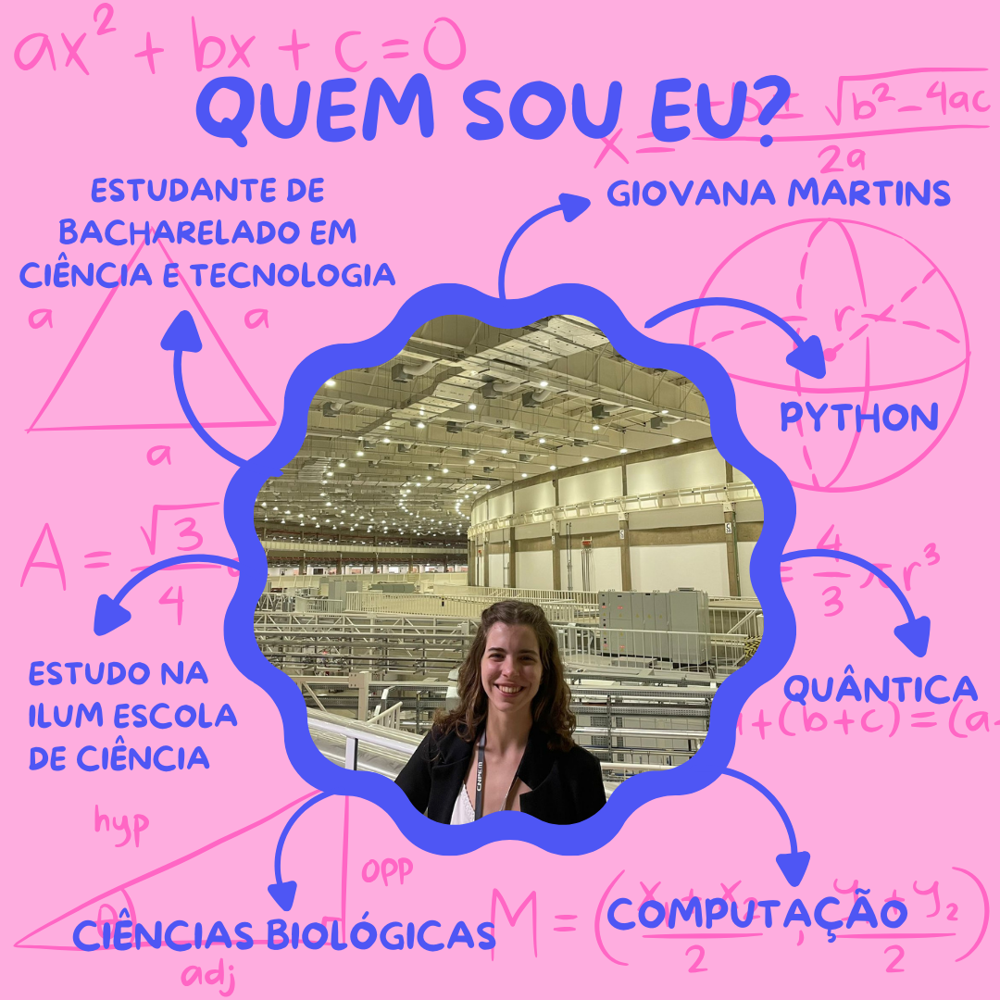

## Sejam bem-vindos! 🌟📘

 

🧪 Atualmente, curso o segundo semestre de Bacharelado em Ciência e Tecnologia na Ilum Escola de Ciência, a faculdade do Centro Nacional de Pesquisa em Energia em Materias, em Campinas-SP.

🧫 Sou muita interessada por biotecnologia e biologia molecular!

🖥️ Fique a vontade para explorar os códigos desenvolvidos! Sou iniciante em programação, os repositórios disponíveis são bastantes didáticos e foram feitos por equipes de alunos Ilum. Espero que possam ser úteis para seu aprendizado! 

🌐 [Currículo Lattes](https://lattes.cnpq.br/1930244511322681) |
[E-mail institucional](giovana24008@ilum.cnpem.br) |
[Linkedin](linkedin.com/in/giovana-martins-coelho-a325852ab) |

<!--
**giovana2005/giovana2005** is a ✨ _special_ ✨ repository because its `README.md` (this file) appears on your GitHub profile.

Here are some ideas to get you started:

- 🔭 I’m currently working on ...
- 🌱 I’m currently learning ...
- 👯 I’m looking to collaborate on ...
- 🤔 I’m looking for help with ...
- 💬 Ask me about ...
- 📫 How to reach me: ...
- 😄 Pronouns: ...
- ⚡ Fun fact: ...
-->
